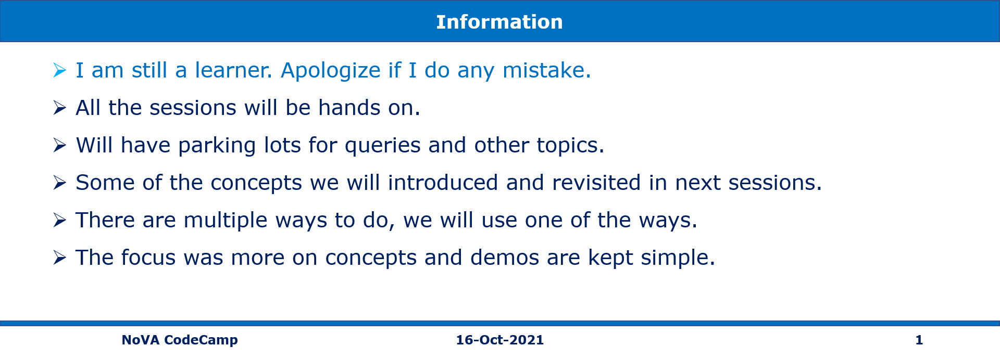

# Cloud Native Full Stack Application in Azure

## Continous Integration Builds

| Project      | Build Status |  Project      | Build Status |   Project      | Build Status | 
| :---        |    :----:   |  :---        |    :----:   |   :---        |    :----:   | 
| Web API .NET 5  | [](https://github.com/vishipayyallore/blazorwasm-apim-api-sql-redis/actions/workflows/Books.API-CI.yml)     |  Web App  .NET 5 | [](https://github.com/vishipayyallore/blazorwasm-apim-api-sql-redis/actions/workflows/Books.Web-CI.yml)        | Data Store | [](https://github.com/vishipayyallore/blazorwasm-apim-api-sql-redis/actions/workflows/BooksDataStore-CI.yml)       | 
| Web API   .NET 6     |  [](https://github.com/vishipayyallore/blazorwasm-apim-api-sql-redis/actions/workflows/Books.API-DotNet6-CI.yml)     |  Web App  .NET 6    |   [](https://github.com/vishipayyallore/blazorwasm-apim-api-sql-redis/actions/workflows/Books.Web-DotNet6-CI.yml)    |  Data Store        |  Same as above     | 
|         |       |         |       |          |       | 

## Application Architecture Diagram 


## Technologies Used

1. Blazor WASM, 
1. Auth0, 
1. APIM, 
1. Web API
1. Key Valut
1. Dapper 
1. Azure SQL Server 
1. Redis
1. Application Insights

---

## Books Data Store .sqlproj
To be done


## Books API
To be done

### Books API .NET 5
To be done

### Books API .NET 6
To be done


## Books Web Blazor WASM
Books store Blazor Web Assembly is deployed to Azure App Service Web Apps.

### Books Web .NET 5
To be done

### Books Web .NET 6
To be done


## Authentication and Authorization using Auth0
To be done

### Access Token
To be done

### Id Token
To be done


## Azure API Management
To be done


## Azure Key Valut
To be done


## Azure SQL Server
To be done


## Azure Redis Cache
To be done


## Application Insights
To be done


## Q&A
To be done


## Panel Discussion
To be done

```
1	/images/books/Book2.jpg	C#	Mithnu Nair	1	A101	101
2	/images/books/Book10.jpg	Java	George Reddy	0	B101	202
3	/images/books/Book5.jpg	Python	Vignesh Iyer	0	C101	303
4	/images/books/Book8.jpg	Azure Functions	Scott Rudy	0	D102	404
5	/images/books/Book7.jpg	Azure VMs	Mohd Azim	0	E103	505
```

---

## Create Ubuntu/Windows VMs in Azure - Portal, PowerShell, CLI, and ARM on 13-Oct-2021 at 09:00 AM IST

## Session **3** of **20** Sessions

## Event URL: [https://www.meetup.com/microsoft-reactor-bengaluru/events/281043714](https://www.meetup.com/microsoft-reactor-bengaluru/events/281043714)


---

## Application Architecture Diagram


---

## Resources in Azure

```
To Be Done
```

## Information



## What are we doing today?

> 1. Introduction to Virtual Machines
> 1. Creating Ubuntu VM and installing nginx using PowerShell. Use SSH Keys instead of password. Accessing the default page
> 1. Creating Windows VM and installing IIS using PowerShell. Accessing the default page
> 1. Creating Ubuntu VM and installing LAMP Server using Azure CLI. Use SSH Keys instead of password. Accessing the default page
> 1. Creating Windows VM and installing IIS using Azure CLI. Accessing the default page
> 1. Creating Ubuntu VM using ARM template and Azure CLI. Use SSH Keys instead of password. Accessing the default page
> 1. Creating Windows VM using ARM template and Azure CLI. Accessing the default page
> 1. Secure your Azure SQL Database
> 1. SUMMARY / RECAP / Q&A


---

## 1. Introduction to Virtual Machines

> 1. To be done

### Search VM Images

`infrastructure\VMs\PowerShell\SearchVms.ps1`


## 2. Creating Ubuntu VM and installing nginx using PowerShell

**Note:** Use SSH Keys instead of password

> 1. Discussion and Demo


## 3. Creating Windows VM and installing IIS using PowerShell

> 1. Discussion and Demo


## 4. Creating Ubuntu VM and installing LAMP Server using Azure CLI

**Note:** Use SSH Keys instead of password

> 1. Discussion and Demo


## 5. Creating Windows VM and installing IIS using Azure CLI

> 1. Discussion and Demo


## 6. Creating Ubuntu VM using ARM template and Azure CLI

**Note:** Use SSH Keys instead of password

> 1. Discussion and Demo


## 7. Creating Windows VM using ARM template and Azure CLI

> 1. Discussion and Demo


## 8. Secure your Azure SQL Database

> 1. Discussion and Demo

## 9. SUMMARY / RECAP / Q&A

---

> 1. SUMMARY / RECAP / Q&A
> 2. Any open queries, I will get back through meetup chat/twitter.

---

## What is Next? (`Session 4` of `20 Sessions` on 27-Oct-2021)

> 1. Secure your Azure SQL Database
> 1. Availability Zone, Availability Set, Proximity, Azure Spot Instance
> 1. Back up your virtual machines, Azure Bastion
> 1. Deploying ASP.Net Core Web API into IIS inside Azure VM
> 1. Deploying ASP.Net Razor Application into IIS inside Azure VM
> 1. Integrating ASP.Razor and ASP.Net Core Web API
> 1. Deploying Blazor WASM Application into IIS inside Azure VM
> 1. Integrating Blazor WASM and ASP.Net Core Web API
