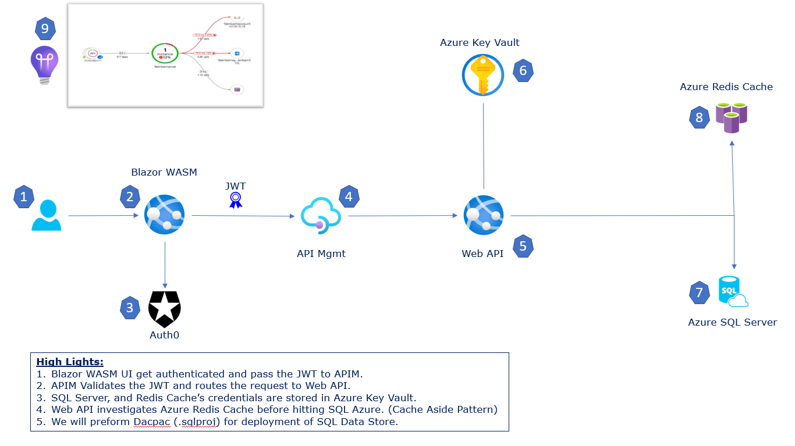

# N-Tier Full Stack Application in Azure

## Continous Integration Builds

| Project      | Build Status |  Project      | Build Status |   Project      | Build Status | 
| :---        |    :----:   |  :---        |    :----:   |   :---        |    :----:   | 
| Data Store .sqlproj      |        | Books Web API   |      |  Books Web App   |         | 
|         |       |         |       |          |       | 
---
## Application Architecture Diagram

---

## Technologies Used

1. Blazor WASM, 
1. Auth0, 
1. APIM, 
1. Web API
1. Key Valut
1. Dapper 
1. Azure SQL Server 
1. Redis
1. Application Insights

---
## Topic 1

---
## Topic 2

